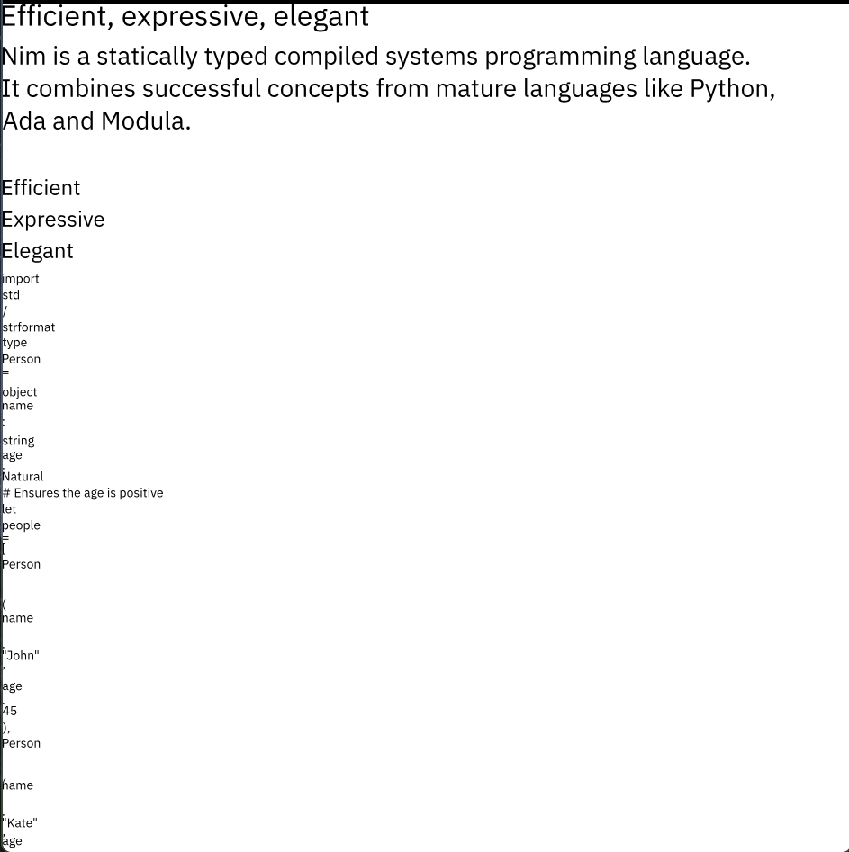

# The Ferus Web Engine
The Ferus web engine is a tiny web engine written in Nim which aims to be a full replacement for something like Chromium's Blink, Safari's WebKit or Firefox's Gecko.

# Features
- When possible, we write our own solution to a component of the overall modern web stack. This has resulted in projects like Stylus (our CSS3 compliant parser derived from Servo) and Bali (our JavaScript engine based on Mirage, our bytecode interpreter) and Sanchar (our HTTP client and URL parser) that are beneficial for the overall Nim community.

- Maximizing security will be our number one priority once we're past the toy engine stage. We have a sandbox that (mostly) works, but it has been disabled by default for the sake of everyone's (mostly our) sanity. If you want to try it out (and improve it), uncomment `-d:ferusInJail` in `nim.cfg`.

- Everything is multiprocessed. This ensures that an error in one component (say, the JavaScript engine) won't bring down the entire session*

# Ferus is getting redesigned!
For the past few months, I've been writing a CSS3 parser, a HTTP client, a bytecode interpreter, and a renderer for Ferus. It's about time to start assembling everything into one (if you want to be accurate, two) binaries! Everything's getting reworked.

There's also a Nix shell available with all the foreign dependencies Ferus needs.

So far,
- The old, error prone IPC layer has been replaced with a new IPC library as well!
- The old firejail-based sandbox has been replaced with Seccomp instead!

# Roadmap for the overall project
- Implementing `spawn<XYZ>` functions in the master process
- Implementing the worker process component
- Implementing the network process component [X]
- Implementing the renderer process component [X]
- Implementing the HTML parser process component [X]
- Implementing the CSS parser process component
- Plugging the layout engine with ferusgfx [X]
- Getting Mirage up to speed [X]
- Finalizing Stylus' API [X]
- Layout compliance
- Implementing the JavaScript runtime process component

## Reality check on the progress
I started this project when I was 14 to learn how the web works. It took me a while to learn a lot of things about the web (and I appreciate that!). I'm not some ex-WebKit/Blink/Gecko contributor or anything like that. My experience is currently fairly limited in web engine development. \
I'm a student (currently 15) and I have tons of other things to do aside from this little pet project of mine. I'm trying my best to do everything, but I have my limits as well. \
I hope to be able to devote the vast majority of my time to this project from next year onwards as this year's pretty important for my academics.

# Attributions
Most of the HTML/DOM logic is taken from [Chawan](https://sr.ht/~bptato/chawan). Without them, this project wouldn't be possible (or atleast not in this state!) :) \
You can check `ATTRIBUTIONS.md` for more credits.

# Hacking on Ferus
For details on building/hacking on Ferus, consult the `BUILDING.md` document.
